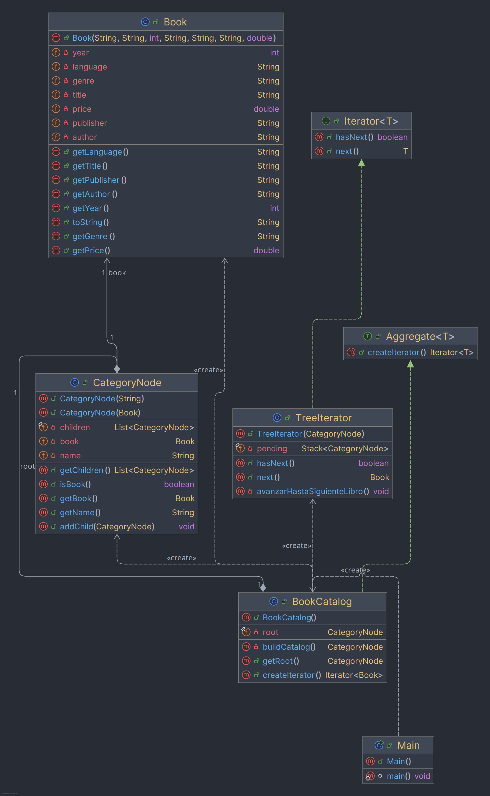

# Amazon Kindle - Patron Iterator (Arbol Jerarquico)

Este repositorio contiene mi parte de la actividad de Patrones de Diseño de
Software: implementar el patrón **Iterator** sobre un caso práctico de
comercio electrónico. Elegimos como caso **Amazon Kindle Store**, y mi parte
es el recorrido del catálogo usando un **árbol jerárquico**.

## Estructura del proyecto


- `model`: clases de datos (el libro y el nodo del árbol).
- `iterator`: las piezas del patrón (interfaces `Aggregate` e `Iterator`, y
  sus implementaciones `BookCatalog` y `TreeIterator`).
- `app`: clase `Main`, el cliente que usa el iterador.

## Diagrama de clases



## La colección: árbol jerárquico

El catálogo es un árbol N-ario hecho con `CategoryNode`. Cada nodo puede ser
una categoría (con hijos) o un libro (hoja con un objeto `Book`):

```
Kindle Store
├── Ficcion
│   ├── Clasicos
│   │   ├── El Principito
│   │   ├── Cien Años de Soledad
│   │   └── 1984
│   └── Fantasia
│       ├── El Hobbit
│       └── Harry Potter y la Piedra Filosofal
├── Tecnologia
│   ├── Programacion
│   │   ├── Clean Code
│   │   └── Design Patterns in Action
│   └── A Brief History of Time
└── Negocios
    ├── Padre Rico, Padre Pobre
    └── El Arte de la Guerra
```

Elegimos el árbol porque así es como está organizada una tienda como Kindle:
categoría -> subcategoría -> libro. La relación "contiene a" se representa
de forma muy natural con un nodo que tiene una lista de hijos.

Los datos de los libros (titulo de la edición, autor, editorial, año y
precio en dólares '$') los saqué buscando esos libros en Amazon Kindle Store, para
que el catálogo se parezca a lo que uno vería en la tienda real.

## Algoritmo elegido: DFS Pre-order

El recorrido que implementé es **DFS (Depth-First Search) en Pre-order**,
usando una **pila (Stack)** en `TreeIterator`.

Cómo funciona: empiezo con la raiz en la pila. Cada vez que se llama a
`next()`, si el nodo de arriba de la pila es una categoría, lo saco y meto
a sus hijos (en orden inverso, para que el primero quede arriba). Repito
esto hasta que el nodo de arriba sea un libro, y ese libro es el que se
devuelve.

Podríamos decir en palabras simples que el iterador "entra" a la primera categoría, dentro de
esa entra a la primera subcategoría, y asi sigue bajando hasta encontrar un
libro. Cuando termina una rama, sube y sigue con la siguiente que quedó
pendiente.

### Por qué elegí este algoritmo

- Es como navegaría un usuario real en Kindle: entra a una categoría, luego
  a una subcategoría, y ahí ve los libros. DFS Pre-order imita eso, porque
  profundiza en una rama completa antes de pasar a la siguiente.
- Con esta colección (árbol jerarquico) tiene más sentido que un recorrido
  por niveles, porque con Pre-order los libros salen agrupados por categoría
  y subcategoría, en vez de mezclados.
- El cliente (`Main`) solo usa `hasNext()` y `next()`, sin saber que por
  dentro hay un arbol y una pila. Eso es justo lo que busca el patron
  Iterator, separar el recorrido de la estructura interna de la colección.
- La pila calza bien con DFS porque el último nodo que entra es el primero
  en salir, lo que hace que el recorrido baje por una rama antes de volver
  a las demás. Si en vez de pila usara una cola, el recorrido seria por
  niveles (BFS) y el orden de salida cambiaría.

## Patrón Iterator aplicado

| Elemento del diagrama   | Clase en el proyecto |
|--------------------------|----------------------|
| `<Interface> Aggregate`  | `Aggregate<T>`       |
| `<Interface> Iterator`   | `Iterator<T>`        |
| `ConcreteAggregate`      | `BookCatalog`        |
| `ConcreteIterator`       | `TreeIterator`       |
| `Cliente`                | `Main`               |

`BookCatalog` implementa `Aggregate<Book>` y construye el arbol. `TreeIterator`
implementa `Iterator<Book>` con el recorrido DFS Pre-order. `Main` es el
cliente: le pide un iterador al catálogo con `createIterator()` y recorre
los libros sin conocer el árbol por dentro.

## Sobre SOLID

Traté de seguir los principios SOLID: cada clase tiene una sola
responsabilidad, las interfaces permiten agregar otro tipo de recorrido sin
tocar `TreeIterator` ni `Main`, y `Main` depende de las interfaces y no de
las clases concretas.

La parte que no cumple del todo es `BookCatalog`: los libros están escritos
directamente en el codigo (metodo `buildCatalog()`), asi que si se quiere
agregar o quitar un libro hay que modificar esa clase. No es lo ideal para
el principio de abierto/cerrado, pero para esta actividad no tenia una base
de datos ni un servicio externo de donde traer los libros, asi que los dejé
escritos ahí directamente (basados en libros reales de Kindle, como
mencioné antes).

## Salida del programa

